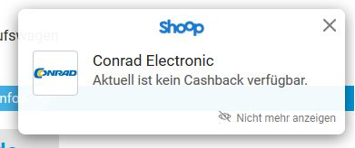

# BetterShoop

The BetterShoop Firefox add-on shows when a website participates in the Shoop.de cashback program. The add-on uses the same data source as Shoop.de's Cashback Assistant, but is otherwise not connected to Shoop.de. BetterShoop only shows a hint when a website participates in the Shoop.de cashback program. No data is collected or addresses are transmitted. The check takes place locally.

* [BetterShoop add-on on Firefox add-ons page](https://addons.mozilla.org/en-US/firefox/addon/bettershoop/)
